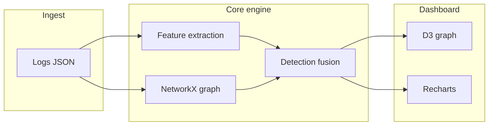

# ShadowTrace AI

**Tagline:** Find the attacker hiding in plain sight.

ShadowTrace AI is a hackathon-ready cybersecurity attribution prototype. It ingests API and network-style request logs, builds an entity interaction graph, fingerprints metadata and timing, and ranks the most likely hidden command-and-control style client with **explainable** fusion scoring.


> Replace the placeholder above with a screenshot of the live dashboard after `npm run dev` + `uvicorn`.

---

## Challenge context

Defenders are flooded with legitimate-looking traffic. Real adversaries hide **beaconing**, **metadata reuse**, and **focused endpoint targeting** inside that noise. ShadowTrace AI helps teams pivot from passive logs to **active hunting** by surfacing a short ranked list of suspects and a narrative explanation backed by measurable features.

---

## Why this is hackathon-relevant

- **No paid APIs** — runs fully offline.
- **Immediate demo** — one-click synthetic generation plus analysis.
- **Visual punch** — D3 force graph + Recharts analytics in a dark SOC-style UI.
- **Explainability** — scores decompose into graph, behavior, and anomaly channels with evidence keys.

---

## Architecture



| Layer | Stack |
|--------|--------|
| Backend | FastAPI, NetworkX, scikit-learn (IsolationForest, KMeans), pandas, NumPy |
| Frontend | React (Vite), D3.js, Tailwind CSS, Recharts |
| Data | Synthetic generator + `sample_data/sample_logs.json` |

---

## How detection works

For each **source IP** (client entity), the engine computes:

1. **Graph score (40%)** — normalized blend of degree, betweenness, PageRank, and weighted degree on a bipartite graph (`ip:*` ↔ `svc:*`).
2. **Behavior score (40%)** — interval consistency (beaconing), header-order concentration, header value repetition, endpoint/service concentration (HHI), UA diversity, burstiness proxy.
3. **Anomaly score (20%)** — `IsolationForest` over a standardized feature matrix; outliers receive a boosted suspicion signal.

**Final score** = `0.4 × graph + 0.4 × behavior + 0.2 × anomaly` (each channel clamped to 0–1 before fusion).

**Confidence** (0–100) is a simple projection of the final score for presentation. The **explanation** string is templated from the strongest contributing signals so judges and operators can follow the reasoning.

**Fingerprint IDs** hash together dominant header signature, UA pattern, interval signature, and endpoint pattern for actor clustering narratives.

---

## Synthetic data and adversarial realism

The generator creates:

- **Benign** — diverse UAs, headers, services, exponential inter-arrival times, realistic status/size/RTT spread.
- **Hidden C2 client** — semi-regular beacon interval, stable header ordering, concentrated calls into plausible telemetry/CDN surfaces, narrow UA family, blended volume so it is not trivially “the only POST.”

Internal ground-truth labels exist for development but are **stripped** before persistence in analyst-facing flows.

---

## Features

- REST ingestion and synthetic generation
- Interactive D3 force-directed attack graph with suspicion styling
- Detection panel with fusion breakdown + fingerprint ID + ranked watchlist
- Metadata charts: timeline, frequency, interval consistency, header concentration, benign vs suspicious aggregates
- Timeline scrubber with heat strip + chart reference line
- Export analysis JSON (UI button + `GET /export`)

---

## Local setup

### Backend

```bash
cd backend
python -m venv .venv
# Windows PowerShell:
.\.venv\Scripts\Activate.ps1
# macOS / Linux:
# source .venv/bin/activate
pip install -r requirements.txt
uvicorn app.main:app --reload
```

### Frontend

```bash
cd frontend
npm install
npm run dev
```

Open the printed local URL (typically `http://127.0.0.1:5173`). Ensure the backend is on port **8000** so the Vite `/api` proxy works, or set `VITE_API_URL` to your API origin.

### Quick demo script

1. Start backend + frontend.
2. Click **Generate + analyze** in the UI.
3. Inspect the highlighted graph nodes and the attribution narrative.

---

## API reference

| Method | Path | Description |
|--------|------|-------------|
| `GET` | `/health` | Liveness probe |
| `POST` | `/generate-data` | Body: `{ "num_logs": 1200, "seed": null }` → synthetic logs |
| `POST` | `/analyze` | Body: `{ "logs": [ LogEntry, ... ] }` → full analysis |
| `GET` | `/graph` | Last graph + summary snapshot |
| `GET` | `/summary` | Last summary only |
| `GET` | `/export` | Last export blob (ranked nodes + metrics) |
| `GET` | `/snapshot` | Full last analysis (for live UI polling) |
| `GET` | `/ingest/status` | Rolling buffer size, analysis revision, optional watch dir |
| `POST` | `/ingest/upload` | Multipart file (`file`) + query `mode=replace\|append` → parse JSON/NDJSON → analyze |
| `DELETE` | `/ingest/buffer` | Clear rolling buffer |

### Real-time / production-style ingest

- **Dashboard:** “Real-time ingest” panel — drag-and-drop `.json` / `.jsonl`, choose **Replace** or **Append** (rolling window, default max **100k** rows via `SHADOWTRACE_BUFFER_MAX`).
- **Live sync:** Checkbox polls `/ingest/status` + `/snapshot` every **2s** so the UI updates when something else ingests data (e.g. folder watch).
- **Folder watch:** Set env **`SHADOWTRACE_WATCH_DIR`** to a directory (repo includes `ingest_drop/`), restart the API. New or changed `.json` / `.jsonl` files are debounced and merged per **`SHADOWTRACE_WATCH_MODE`** (`append` default, or `replace`).

**Log entry fields:** `source_ip`, `destination_service`, `endpoint`, `timestamp`, `headers`, `user_agent`, `method`, `status_code`, `request_size`, `response_time_ms`.

Interactive OpenAPI: `http://127.0.0.1:8000/docs`

---

## Repository layout

```
shadowtrace-ai/
├── backend/           # FastAPI application
├── frontend/          # Vite React dashboard
├── ingest_drop/       # Optional folder for SHADOWTRACE_WATCH_DIR
├── sample_data/       # Example logs
├── README.md
└── .gitignore
```

---

## Publishing to GitHub

From the `shadowtrace-ai` directory (or move it to your preferred root):

```bash
git init
git add .
git commit -m "Initial commit: ShadowTrace AI attribution platform"
git branch -M main
git remote add origin https://github.com/<you>/<repo>.git
git push -u origin main
```

---

## Screenshots checklist

Add your own captures under `docs/` (optional) and link them here:

- [ ] Full dashboard overview
- [ ] Graph with suspect highlighted
- [ ] Detection panel explanation

---

## Future improvements

- Edge timestamps for true per-edge timeline replay on the graph
- Streaming ingestion (Kafka / HTTP long-poll) for live SOC mode
- Graph projection layers (source–source similarity edges)
- Calibrated probabilities via labeled validation sets
- Role-based auth and multi-tenant workspaces

---

## License

MIT by default — adjust before public release if your hackathon requires a different license.
